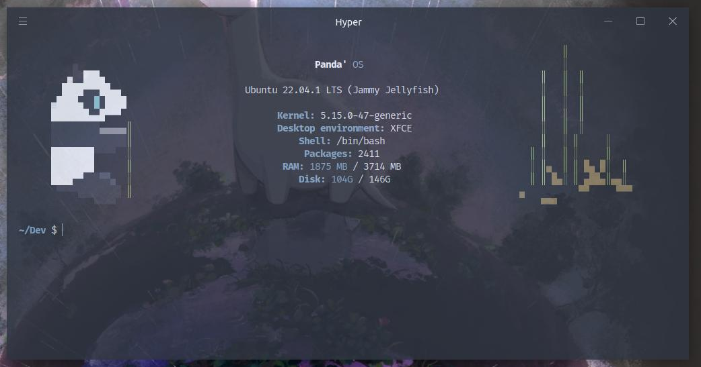
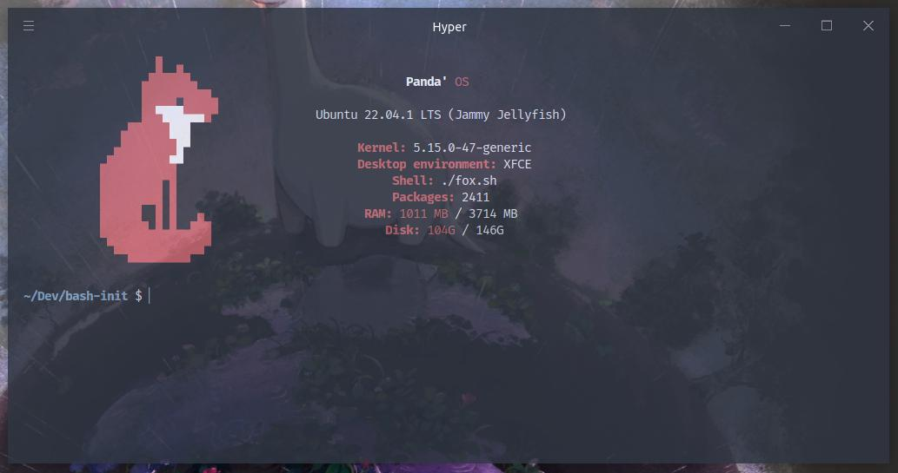

<div align='center'>

# Bash Init


## Instalation
Just past the drawing you liked best in `~/`,  
and put this code inside the `~/.bashrc` file.

<div align='left'>

```sh
./<the drawing you choosed>.sh $0
```
</div>

## Themes
_Click in the theme to go to it._

_Panda_
[](panda.sh)

_Moon_
[](moon.sh)

_Plant_
[](plant.sh)

_Dog_
[](dog.sh)

_Fox_
[](fox.sh)
